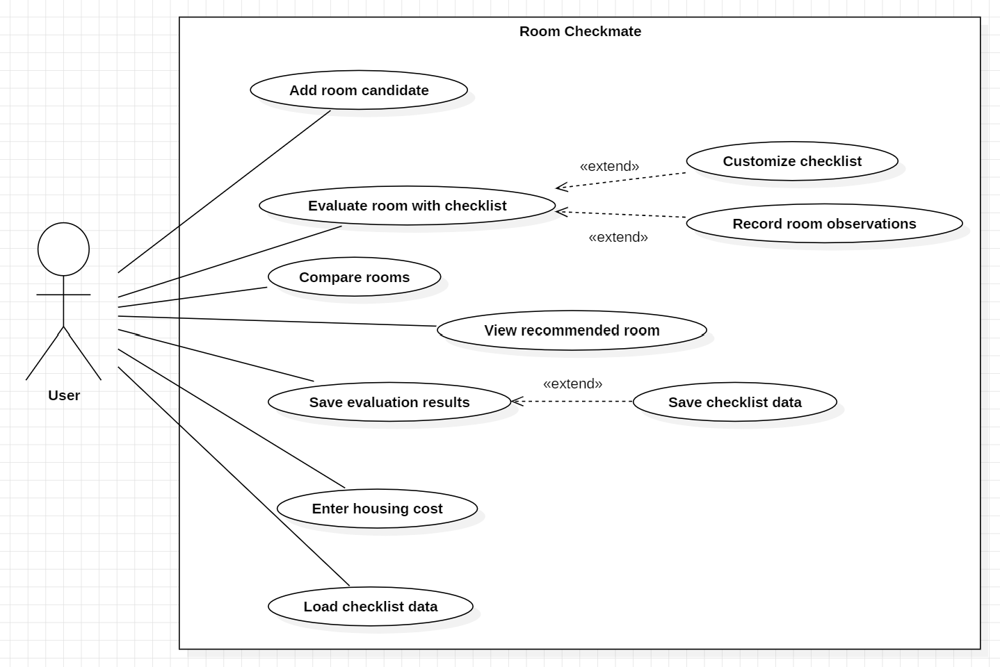

# Room Checkmate : Analysis Document

- **A decision support web app for rental room selection**
(자취방 선택을 위한 의사결정 지원 웹 애플리케이션)

  

| 항목 | 내용 |
|:----:|:----:|
| Student No | 22421583 |
| Name | 유혜령 |
| E-mail | hry8585@yu.ac.kr |
| GitHub | https://github.com/HyeRyeongYu/room-decision-assistant |
 

## Revision History

| Revision date | Version | Description |
|:----:|:------:|:------------|
| 2026-05-02 | **0.1** | Initial draft |
| 2026-05-02 | **0.2** | Introduction |
| 2026-05-03 | **0.3** | Use Case Analysis |
| 2026-05-03 | **0.4** | Domain analysis |
 

# = Contents =
## 1. Introduction

## 2. Use Case Analysis

## 3. Domain analysis

## 4. User Interface Prototype

## 5. Glossary

## 6. References
 

# 1. Introduction

## 1.1 Summary
- 2030세대는 학업과 취업 등의 이유로 자취를 시작하는 경우가 많으며, 주거를 결정하는 과정에서 여러 후보 매물을 비교하고, 다양한 요소를 고려해야 한다. 하지만, 관련 경험과 정보의 부족, 전문 용어에 대한 이해 부족으로 인해 합리적인 의사결정에 어려움을 겪는 경우가 많다. 특히, 공인중개사는 법적으로 계약 직전에 중개대상물 확인·설명서를 제공할 의무가 있으나, 해당 문서는 법률 용어를 중심으로 작성되어 있어, 예비 임차인이 충분히 내용을 이해하고, 활용하기 어렵다. 또한, 여러 후보 매물의 상태를 체계적으로 기록하고 비교할 수 있는 도구나 문서가 제공되지 않기에, 임차인이 개별적으로 정보를 관리해야 한다. 이 과정에서 중요한 확인 요소의 누락이 발생할 수 있으며, 계약 체결 이후 예상하지 못한 문제를 해결하기 위해 추가적인 시간과 비용이 발생하는 상황에 직면할 수 있다.
- 따라서, 본 시스템에서는 주거 매물 선택 과정에서 발생할 수 있는 문제와 어려움을 해결하기 위해, 법적 문서를 기반으로 하는 체크리스트를 제공한다. 이를 통해, 사용자의 법률 용어에 대한 장벽을 낮추고, 다양한 후보 매물을 체계적으로 평가하고, 비교할 수 있도록 한다. 나아가, 의사결정 과정의 정확도를 높여, 중개 계약 이후의 리스크를 줄이는 것을 목표로 한다.

## 1.2 Business Goals
- 체크리스트 기반 평가를 통해, 주거 선택 과정에서 발생할 수 있는 정보 누락을 줄인다.
- 사용자가 여러 매물을 체계적으로 비교하여, 합리적인 의사결정을 할 수 있도록 지원한다.
- 법적 문서를 기반으로 체크리스트의 항목을 제공하여, 법률 용어에 대한 이해도를 향상시킨다.

## 1.3 Technical Goals
- 체크리스트 생성 및 사용자 맞춤 항목 추가 기능을 제공한다.
- 체크리스트의 항목에 대한 평가를 입력하고, 정량적으로 비교할 수 있도록 평가 점수를 제공한다.
- 중개대상물 확인·설명서의 법률 용어를 체크리스트 항목과 함께 제공한다.
- 브라우저의 localStorage를 활용한 데이터 저장과 JSON을 기반으로 파일 관리 기능을 구현한다.
 

# 2. Use Case Analysis
## 2.1 Use Case Diagram
- 아래의 그림은 Room Checkmate 시스템의 Use Case Diagram을 그림으로 나타낸 것이다.

[Figure 1. Use_Case_Diagram]  

- 제안된 Room Checkmate 시스템은 개인 사용자를 대상으로 실행되므로, Actor는 User 한 명으로 설정하였다.
- Conceptualization(개념화 단계)에서 작성한 System context diagram과 Use case list를 기반으로, Use case diagram을 다음과 같이 구성하였다.
- 모델링 도구는 StarUML을 사용하였으며, 이를 통해 Actor와 Use case 간의 관계, Use case들 사이의 관계를 나타내었다.
- 이때, Actor와 상호작용을 하는 Use case는 Association 관계로 연결했고, 해당 Use case가 수행되기 위해서, 필요한 Use case는 Include 관계로 연결했으며, 기본 Use case 수행 중에 해당 Use case를 선택할 수 있는 경우 Extend 관계로 연결했다.

## 2.2 Use Case Description
## Use Case #1 : Add room candidate (체크리스트 생성)
### [GENERAL CHARACTERISTICS]

| 항목 | 내용 |
|------|------|
| Summary | 사용자가 비교를 위해 새로운 후보 매물 체크리스트를 생성한다.  |
| Scope | Room Checkmate System |
| Level | User level |
| Author | HR Yu |
| Last Update | 2026-04-29 |
| Status | Analysis (Finalize) |
| Primary Actor | User |
| Preconditions | 시스템에 접속 중이며, 사용자가 체크리스트 메뉴를 선택한 상황이어야 한다. |
| Trigger | 사용자가 체크리스트 생성 버튼을 클릭한다. |
| Success Post Condition | 새로운 체크리스트가 생성되며, 체크리스트 목록에 추가된다. |
| Failed Post Condition | 체크리스트가 생성되지 않는다. |

---

### [MAIN SUCCESS SCENARIO]

| Step | Action |
| :------: |--------|
| 1 | 사용자가 메뉴의 체크리스트를 클릭한다. |
| 2 | 시스템이 체크리스트 생성을 위한 초기 정보 입력 화면을 제공한다. |
| 3 | 사용자가 매물 유형을 선택한다. |
| 4 | 사용자가 계약 유형(전세/월세)을 선택한다. |
| 5 | 사용자가 체크리스트 이름을 입력한다. |
| 6 | 사용자가 체크리스트 생성 버튼을 클릭한다. |
| 7 | 시스템은 입력된 정보를 기반으로 새로운 체크리스트를 생성하고, 이를 저장한다. |
| 8 | 시스템은 생성된 체크리스트를 목록에 추가한다. |

---

### [EXTENSION SCENARIOS]

| Step | Branching Action |
| :--: |----------------|
| 6 | (사용자가 초기 정보 입력을 누락한 경우) |
| 6a | **사용자가 매물 유형 선택을 누락한 경우** |
| 6a1 | 시스템은 매물 유형 선택 누락 메시지를 띄운다. |
| 6a2 | 시스템은 사용자에게 매물 유형을 선택하도록 안내한다. |
| 6b | **사용자가 계약 유형 선택을 누락한 경우** |
| 6b1 | 시스템은 계약 유형 선택 누락 메시지를 띄운다. |
| 6b2 | 시스템은 사용자에게 계약 유형을 선택하도록 안내한다. |
| 6c | **사용자가 체크리스트 이름 입력을 누락한 경우** |
| 6c1 | 시스템은 체크리스트 이름 입력 누락 메시지를 띄운다. |
| 6c2 | 시스템은 사용자에게 체크리스트 이름을 입력하도록 안내한다. |

---

### [RELATED INFORMATION]

| 항목 | 내용 |
|------|------|
| Performance | ≦ 1 Seconds |
| Frequency | 사용자가 체크리스트 생성할 때마다  |
| Concurrency | Not applicable (single-user browser environment) |
| Due Date | 2026-05-03 |
 

## Use Case #2 : Enter housing cost (체크리스트 주거비용 입력)

### [GENERAL CHARACTERISTICS]

| 항목 | 내용 |
|------|------|
| Summary | 사용자가 체크리스트에 주거 비용 정보를 입력한다. |
| Scope | Room Checkmate System |
| Level | User level |
| Author | HR Yu |
| Last Update | 2026-04-29 |
| Status | Analysis (Finalize) |
| Primary Actor | User |
| Preconditions | 체크리스트가 생성되어 있어야 하며, 사용자가 해당 체크리스트를 선택한 상태여야 한다. |
| Trigger | 사용자가 체크리스트에서 주거 비용 항목을 선택한다. |
| Success Post Condition | 입력된 주거 비용 정보가 체크리스트에 반영된다. |
| Failed Post Condition | 주거 비용 정보가 입력되지 않았거나 일부만 입력된 경우, 해당 항목은 반영되지 않은 상태로 저장된다. |

---

### [MAIN SUCCESS SCENARIO]

| Step | Action |
| :------: |--------|
| 1 | 사용자가 체크리스트를 선택한다.  |
| 2 | 시스템이 선택한 체크리스트를 화면에 띄운다. |
| 3 | 사용자가 주거 비용 그룹을 선택한다. |
| 4 | 시스템이 주거 비용 항목의 입력란을 제공한다. |
| 5 | 사용자가 관리비, 월세(전세), 보증금 정보를 입력한다. |
| 6 | 사용자가 체크리스트 저장 버튼을 클릭한다. |
| 7 | 시스템은 입력된 주거 비용 항목의 정보를 체크리스트에 반영하고 저장한다. |

---

### [EXTENSION SCENARIOS]

| Step | Branching Action |
| :------: |----------------|
| 6a | **사용자가 주거 비용 항목 입력 후 저장하지 않고 다른 화면으로 이동하려는 경우** |
| 6a1| 시스템은 저장되지 않은 주거 비용 내용이 있음을 알리는 메시지를 표시한다. |
| 6a2 | 사용자는 저장 후 이동하거나, 저장하지 않고 이동을 선택한다. |

---

### [RELATED INFORMATION]

| 항목 | 내용 |
|------|------|
| Performance | ≦ 1 Seconds |
| Frequency | 사용자가 체크리스트에서 주거 비용 항목을 입력할 때마다 |
| Concurrency | Not applicable (single-user browser environment) |
| Due Date | 2026-05-03 |
 

## Use Case #3 : Evaluate room with checklist (체크리스트 항목 평가)
### [GENERAL CHARACTERISTICS]

| 항목 | 내용 |
|------|------|
| Summary | 사용자가 체크리스트 항목을 기준으로 방을 평가하고 총점 계산을 통해 평가 결과를 확인한다. |
| Scope | Room Checkmate System |
| Level | User level |
| Author | HR Yu |
| Last Update | 2026-05-03 |
| Status | Analysis (Finalize) |
| Primary Actor | User |
| Preconditions | 체크리스트가 생성되어 있어야 하며, 사용자가 해당 체크리스트를 선택한 상태여야 한다. |
| Trigger | 사용자가 체크리스트 항목을 평가한다. |
| Success Post Condition | 총점수가 계산되어 체크리스트에 반영되며, 사용자는 계산된 총점수 평가 결과를 확인할 수 있다. |
| Failed Post Condition | 필수 항목의 평가가 누락된 경우, 총점수가 계산되지 않으며 누락된 항목에 대한 팝업 메시지가 사용자에게 제공된다. |

---

### [MAIN SUCCESS SCENARIO]

| Step | Action |
| :------: |--------|
| 1 | 사용자가 체크리스트를 선택한다. |
| 2 | 시스템이 선택한 체크리스트를 화면에 띄운다. |
| 3 | 사용자는 각 그룹의 항목에 대해 상/중/하 중 1개를 선택하여, 평가한다. |
| 4 | 사용자가 총점수 계산 버튼을 클릭한다. |
| 5 | 시스템은 평가된 기본 항목과 사용자 맞춤 항목(존재하는 경우)을 포함하여 총점을 계산한다. |
| 6 | 시스템은 사용자에게 계산된 총점수를 팝업 메시지로 보여준다. |

---

### [EXTENSION SCENARIOS]

| Step | Branching Action |
| :------: |----------------|
| 4a | **사용자가 필수 항목의 평가를 누락한 경우**|
| 4a1 | 시스템은 누락된 항목의 그룹 번호와 항목 번호를 사용자에게 안내한다. |
| 4a2 | 시스템은 체크리스트의 총점수를 계산하지 않는다. |

---

### [RELATED INFORMATION]

| 항목 | 내용 |
|------|------|
| Performance | ≦ 1 Seconds |
| Frequency | 사용자가 체크리스트에서 항목을 평가할 때마다 |
| Concurrency | Not applicable (single-user browser environment) |
| Due Date | 2026-05-03 |
  

## Use Case #4 : Customize checklist) (체크리스트 사용자 맞춤 항목 추가)
### [GENERAL CHARACTERISTICS]

| 항목 | 내용 |
|------|------|
| Summary | 사용자가 기본 체크리스트 외에 추가로 맞춤 항목 입력을 원하는 경우, 사용자 맞춤 항목을 추가한다. |
| Scope | Room Checkmate System |
| Level | User level |
| Author | HR Yu |
| Last Update | 2026-05-03 |
| Status | Analysis (Finalize) |
| Primary Actor | User |
| Preconditions | 체크리스트가 생성되어 있어야 하며, 사용자가 해당 체크리스트를 선택한 상태여야 한다. |
| Trigger | 사용자가 체크리스트의 맞춤 항목 추가 버튼을 클릭한다. |
| Success Post Condition | 입력된 사용자 맞춤 항목이 체크리스트에 추가되어, 평가 항목으로 반영된다. |
| Failed Post Condition | 사용자 맞춤 항목이 추가되지 않는다. |

---

### [MAIN SUCCESS SCENARIO]

| Step | Action |
| :------: |--------|
| 1 | 사용자가 체크리스트를 선택한다.  |
| 2 | 시스템이 선택한 체크리스트를 화면에 띄운다. |
| 3 | 사용자가 체크리스트의 맞춤 항목 추가 버튼을 클릭한다. |
| 4 | 시스템은 사용자 맞춤 항목 입력 화면을 제공한다. |
| 5 | 사용자가 그룹과 항목의 내용을 입력한다. |
| 6 | 시스템은 선택된 체크리스트에 사용자 맞춤 항목의 내용을 반영한다.|

---

### [EXTENSION SCENARIOS]

| Step | Branching Action |
| :------: |----------------|
| 3a | **사용자가 허용된 최대 개수를 초과하여 맞춤 항목을 추가하려는 경우** |
| 3a1 | 시스템은 맞춤 항목의 최대 개수 제한을 안내하는 메시지를 보여준다. |
| 3a2 | 시스템은 맞춤 항목의 추가 생성을 제한한다. |

---

### [RELATED INFORMATION]

| 항목 | 내용 |
|------|------|
| Performance | ≦ 1 Seconds |
| Frequency | 사용자가 맞춤 항목 추가 버튼을 누를 때마다 |
| Concurrency | Not applicable (single-user browser environment) |
| Due Date | 2026-05-03 |
 

## Use Case #5 : Record room observations (체크리스트 메모 추가)

### [GENERAL CHARACTERISTICS]

| 항목 | 내용 |
|------|------|
| Summary | 사용자가 후보 매물에 대한 관찰 사항, 매물 확인 후의 생각, 특이 사항 등을 작성할 수 있는 입력란을 제공한다. |
| Scope | Room Checkmate System |
| Level | User level |
| Author | HR Yu |
| Last Update | 2026-05-03 |
| Status | Analysis (Finalize) |
| Primary Actor | User |
| Preconditions | 체크리스트가 생성되어 있어야 하며, 사용자가 해당 체크리스트를 선택한 상태여야 한다. |
| Trigger | 사용자가 메모 항목을 선택한다. |
| Success Post Condition | 입력된 메모 내용이 선택된 체크리스트에 반영되며, 사용자는 해당 내용을 확인할 수 있다. |
| Failed Post Condition | 입력된 메모 내용이 없는 경우, 체크리스트에 반영되지 않는다. |

---

### [MAIN SUCCESS SCENARIO]

| Step | Action |
| :------: |--------|
| 1 | 사용자가 체크리스트를 선택한다. |
| 2 | 시스템이 선택한 체크리스트를 화면에 띄운다. |
| 3 | 사용자가 메모 그룹의 항목을 선택한다. |
| 4 | 시스템은 선택한 체크리스트의 메모 항목에 대한 입력 영역을 제공한다. |
| 5 | 사용자는 메모 항목과 내용을 작성하고, 체크리스트 저장 버튼을 클릭한다. |
| 6 | 시스템은 입력된 메모 내용을 체크리스트에 반영한다. |
---

### [EXTENSION SCENARIOS]

| Step | Branching Action |
| :------: |----------------|
| 5a | **사용자가 메모 내용을 입력한 후 저장하지 않고 다른 화면으로 이동하려는 경우** |
| 5a1 | 시스템은 저장되지 않은 메모 내용이 있음을 알리는 메시지를 표시한다. |
| 5a2 | 사용자는 저장 후 이동하거나, 저장하지 않고 이동을 선택한다. |

---

### [RELATED INFORMATION]

| 항목 | 내용 |
|------|------|
| Performance | ≦ 1 Seconds |
| Frequency | 사용자가 메모 항목의 내용을 입력할 때마다 |
| Concurrency | Not applicable (single-user browser environment) |
| Due Date | 2026-05-03 |
 

## Use Case #6 : Compare rooms (체크리스트 비교) 
### [GENERAL CHARACTERISTICS]

| 항목 | 내용 |
|------|------|
| Summary | 사용자가 선택한 각 매물의 체크리스트 평가 결과를 기반으로 총점 기반 비교 또는 상위 평가 항목 개수 기반 비교를 선택하여 결과를 제공한다. |
| Scope | Room Checkmate System |
| Level | User level |
| Author | HR Yu |
| Last Update | 2026-05-03 |
| Status | Analysis (Finalize) |
| Primary Actor | User |
| Preconditions | 체크리스트가 생성되어 있어야 하며, 사용자가 비교할 체크리스트를 선택한 상태여야 한다. |
| Trigger | 총점수 기반 비교 버튼 또는 상위 평가 항목 개수 기반 비교 버튼을 클릭한다. |
| Success Post Condition | 선택된 체크리스트에 대한 비교 결과를 사용자가 선택한 비교 기준에 따라 생성되어, 사용자에게 제공한다. |
| Failed Post Condition | 비교 결과가 생성되지 않는다. |

---

### [MAIN SUCCESS SCENARIO]

| Step | Action |
| :------: |--------|
| 1 | 사용자가 메뉴의 비교&추천을 클릭한다. |
| 2 | 시스템은 체크리스트 선택 목록과 비교 기준 선택 화면을 제공한다. |
| 3 | 사용자는 비교할 체크리스트를 선택한다. |
| 4 | 사용자는 총점 기반 비교 버튼 혹은 상위 평가 항목 개수 기반 비교 버튼 중 하나를 선택한다. |
| 5 | 시스템은 선택된 기준에 따라 체크리스트를 비교한다. |
| 6 | 시스템은 비교 결과를 화면에 표시한다. |

---

### [EXTENSION SCENARIOS]

| Step | Branching Action |
| :------: |----------------|
| 3a | **사용자가 허용된 최대 개수를 초과하여 체크리스트를 선택하는 경우** |
| 3a1 | 시스템은 체크리스트 선택의 최대 개수 제한을 안내하는 메시지를 표시한다. |
| 3a2 | 시스템은 체크리스트 목록에서 추가 선택을 제한한다. |
| 3b | **사용자가 체크리스트를 선택하지 않은 경우** |
| 3b1 | 시스템은 체크리스트 선택을 요청하는 메시지를 표시한다. |

---

### [RELATED INFORMATION]

| 항목 | 내용 |
|------|------|
| Performance | ≦ 1 Seconds |
| Frequency | 사용자가 비교 기준 버튼(총점 기반 또는 상위 평가 항목 개수 기반)을 클릭할 때마다 |
| Concurrency | Not applicable (single-user browser environment) |
| Due Date | 2026-05-03 |
 

## Use Case #7 : View recommended room (추천 매물 확인)
### [GENERAL CHARACTERISTICS]

| 항목 | 내용 |
|------|------|
| Summary | 사용자가 선택한 체크리스트의 평가 결과를 기반으로, 가장 적합한 매물을 추천한다. |
| Scope | Room Checkmate System |
| Level | User level |
| Author | HR Yu |
| Last Update | 2026-05-03 |
| Status | Analysis (Finalize) |
| Primary Actor | User |
| Preconditions | 체크리스트가 생성되어 있어야 하며, 체크리스트가 평가 완료된 상태여야 한다. |
| Trigger | 사용자가 비교&추천 메뉴를 클릭한다. |
| Success Post Condition | 체크리스트의 평가 결과와 사용자 맞춤 목록 및 주거 비용이 단계적으로 고려하여 가장 적합한 매물을 사용자에게 추천한다. |
| Failed Post Condition | 최적 추천 매물 결과가 생성되지 않는다. |

---

### [MAIN SUCCESS SCENARIO]

| Step | Action |
| :------: |--------|
| 1 | 시스템은 추천 기능을 위한 체크리스트 선택 화면을 제공한다. |
| 2 | 사용자는 추천받을 체크리스트를 선택한다. |
| 3 | 사용자가 최적 매물 추천 버튼을 클릭한다. |
| 4 | 시스템은 추천에 사용할 체크리스트 데이터를 확인한다. |
| 5 | 시스템은 각 체크리스트의 총점수를 비교한다. |
| 6 | 시스템은 사용자 맞춤 항목이 체크리스트에 존재하는 경우 해당 항목을 추가로 고려한다. |
| 7 | 시스템은 유사한 평가 결과를 가진 매물이 있는 경우, 주거 비용을 추가로 고려하여, 최종 비교를 수행한다. |
| 8 | 시스템은 가장 적합한 매물을 선택한다. |
| 9 | 시스템은 추천 결과 화면을 사용자에게 제공한다. |

---

### [EXTENSION SCENARIOS]

| Step | Branching Action |
| :------: |----------------|
| 2a | **평가가 완료되지 않은 체크리스트를 선택하는 경우** |
| 2a1 | 시스템은 평가가 미완료된 체크리스트의 이름을 팝업 메시지를 표시한다. |
| 2a2 | 사용자가 확인 버튼을 누른다. |
| 2a3 | 시스템은 내 체크리스트 관리 메뉴로 이동 여부를 사용자에게 확인 메시지로 표시한다. |
| 2b | **사용자가 추천받을 체크리스트를 선택하지 않은 경우** |
| 2b1 | 시스템은 체크리스트 선택을 요청하는 팝업 메시지를 표시한다. |
| 2b2 | 시스템은 사용자에게 체크리스트 선택 화면으로 안내한다. |

---

### [RELATED INFORMATION]

| 항목 | 내용 |
|------|------|
| Performance | ≦ 1 Seconds |
| Frequency | 사용자가 최적 매물 추천 버튼을 클릭할 때마다 |
| Concurrency | Not applicable (single-user browser environment) |
| Due Date | 2026-05-03 |
 

## Use Case #8 : Save evaluation results (체크리스트 평가 결과 저장)
### [GENERAL CHARACTERISTICS]

| 항목 | 내용 |
|------|------|
| Summary | 사용자가 현재까지 입력 및 평가한 체크리스트의 모든 내용이 선택한 체크리스트에 반영되어 저장된다. |
| Scope | Room Checkmate System |
| Level | User level |
| Author | HR Yu |
| Last Update | 2026-05-03 |
| Status | Analysis (Finalize) |
| Primary Actor | User |
| Preconditions | 체크리스트가 생성되어 있어야 하며, 사용자가 체크리스트를 선택한 상태여야 한다. |
| Trigger | 사용자가 체크리스트 저장 버튼을 클릭한다. |
| Success Post Condition | 체크리스트에 현재까지 작성된 내용이 반영되어 시스템에 저장된다. |
| Failed Post Condition | 체크리스트의 내용이 시스템에 저장되지 않는다. |

---

### [MAIN SUCCESS SCENARIO]

| Step | Action |
| :------: |--------|
| 1 | 사용자가 체크리스트 저장 버튼을 클릭한다. |
| 2 | 시스템은 현재 체크리스트의 입력 및 평가 내용을 확인한다. |
| 3 | 시스템은 체크리스트의 주거 비용, 기본 항목의 평가 결과, 사용자 맞춤 항목 및 메모 내용을 저장한다. |
| 4 | 시스템은 저장 완료 메시지를 사용자에게 표시한다. |

---

### [EXTENSION SCENARIOS]

| Step | Branching Action |
| :------: |----------------|
| 1a | **변경된 내용이 없는 경우** |
| 1a1 | 시스템은 변경된 내용이 없음을 안내하는 팝업 메시지를 표시한다. |
| 1b | **사용자가 체크리스트의 내용을 저장하지 않고 다른 화면으로 이동하려는 경우** |
| 1b1 | 시스템은 저장되지 않은 내용이 있음을 알리는 팝업 메시지를 표시한다. |
| 1b2 | 사용자는 저장 후 이동하거나, 저장하지 않고 이동을 선택한다. |

---

### [RELATED INFORMATION]

| 항목 | 내용 |
|------|------|
| Performance | ≦ 1 Seconds |
| Frequency | 사용자가 체크리스트 저장 버튼을 클릭할 때마다 |
| Concurrency | Not applicable (single-user browser environment) |
| Due Date | 2026-05-03 |
 

## Use Case #9 : Save checklist data (체크리스트 파일로 저장)
### [GENERAL CHARACTERISTICS]

| 항목 | 내용 |
|------|------|
| Summary | 사용자가 선택한 체크리스트의 모든 내용이 외부 파일 형태로 저장된다. |
| Scope | Room Checkmate System |
| Level | User level |
| Author | HR Yu |
| Last Update | 2026-05-03 |
| Status | Analysis (Finalize) |
| Primary Actor | User |
| Preconditions | 체크리스트가 생성되어 있으며 파일로 저장할 체크리스트가 선택된 상태여야 한다. |
| Trigger | 사용자가 외부 파일로 저장하기 버튼을 클릭하는 경우 |
| Success Post Condition | 체크리스트의 내용이 외부 파일 형태로 생성되어 사용자에게 제공된다. |
| Failed Post Condition | 체크리스트의 내용이 외부 파일 형태로 생성되지 않는다. |

---

### [MAIN SUCCESS SCENARIO]

| Step | Action |
| :------: |--------|
| 1 | 사용자가 내 체크리스트 관리 메뉴를 선택한다. |
| 2 | 시스템이 체크리스트 관리 화면을 제공한다. |
| 3 | 사용자가 체크리스트 목록에서 체크리스트를 선택한다. |
| 4 | 사용자가 외부 파일로 저장하기 버튼을 클릭한다. |
| 5 | 시스템은 저장할 체크리스트 데이터를 확인한다. |
| 6 | 시스템은 체크리스트의 전체 데이터를 외부 파일 형식으로 변환한다. |
| 7 | 시스템은 생성된 파일을 사용자에게 다운로드 형태로 제공한다. |
| 8 | 사용자는 파일을 로컬 저장소에 저장한다. |

---

### [EXTENSION SCENARIOS]

| Step | Branching Action |
| :------: |----------------|
| 3a | **사용자가 체크리스트를 선택하지 않은 경우** |
| 3a1 | 시스템은 체크리스트 선택을 요청하는 팝업 메시지를 표시한다. |

---

### [RELATED INFORMATION]

| 항목 | 내용 |
|------|------|
| Performance | ≦ 1 Seconds |
| Frequency | 사용자가 외부로 파일 저장하기 버튼을 클릭할 때마다 |
| Concurrency | Not applicable (single-user browser environment) |
| Due Date | 2026-05-03 |
 

## Use Case #10 : Load checklist data (체크리스트 파일 불러오기) 
### [GENERAL CHARACTERISTICS]

| 항목 | 내용 |
|------|------|
| Summary | 외부 파일 형태로 저장된 체크리스트 데이터를 불러와 기존의 체크리스트 목록에 추가한다. |
| Scope | Room Checkmate System |
| Level | User level |
| Author | HR Yu |
| Last Update | 2026-05-03 |
| Status | Analysis (Finalize) |
| Primary Actor | User |
| Preconditions | 내 체크리스트 관리 화면에 접근 가능한 상태여야 한다. |
| Trigger | 사용자가 외부 파일 불러오기 버튼을 클릭한다. |
| Success Post Condition | 외부 파일의 체크리스트 데이터가 시스템에 추가된다. |
| Failed Post Condition | 외부 파일의 체크리스트 데이터가 시스템에 추가되지 않는다. |

---

### [MAIN SUCCESS SCENARIO]

| Step | Action |
| :------: |--------|
| 1 | 사용자가 내 체크리스트 관리 메뉴를 선택한다. |
| 2 | 시스템이 체크리스트 관리 화면을 제공한다. |
| 3 | 사용자가 외부 파일 불러오기 버튼을 클릭한다. |
| 4 | 시스템은 파일 선택 창을 제공한다. |
| 5 | 사용자는 불러올 외부 파일을 선택한다. |
| 6 | 시스템은 선택된 파일의 데이터를 읽어온다. |
| 7 | 시스템은 외부 파일 데이터를 시스템에서 제공하는 체크리스트 형식으로 변환한다. |
| 8 | 시스템은 변환된 체크리스트를 기존의 체크리스트 목록에 추가한다. |
| 9 | 시스템은 체크리스트 목록을 갱신하여 사용자에게 표시한다. |

---

### [EXTENSION SCENARIOS]

| Step | Branching Action |
| :------: |----------------|
| 5a | **사용자가 외부 파일을 선택하지 않은 경우** |
| 5a1 | 시스템은 파일 선택을 요청하는 안내 메시지를 표시한다. |
| 6a | **선택된 외부 파일의 형식이 아닌 경우** |
| 6a1 | 시스템은 파일 형식 오류 메시지를 표시한다. |
| 7a | **외부 파일 데이터를 시스템의 기존 체크리스트 형식으로 변환하는 데 실패하는 경우** |
| 7a1 | 시스템은 파일을 변환할 수 없음을 안내하는 팝업 메시지를 표시한다. |

---

### [RELATED INFORMATION]

| 항목 | 내용 |
|------|------|
| Performance | ≦ 1 Seconds |
| Frequency | 사용자가 외부 파일 불러오기 버튼을 클릭할 때마다 |
| Concurrency | Not applicable (single-user browser environment) |
| Due Date | 2026-05-03 |
 

# 3. Domain analysis
## 1) Checklist
- Checklist 클래스는 특정 매물(Room)에 대한 평가 정보를 관리하는 클래스이다.
- 해당 클래스에는 체크리스트와 관련된 데이터를(주거 비용, 평가 항목, 메모 등) 포함한다.
- Room Checkmate 시스템은 해당 클래스를 기반으로 매물 간 비교 및 추천 기능을 수행한다.

## 2) Room
- Room 클래스는 비교 대상이 되는 개별 매물 정보를 나타내는 클래스이다.
- 해당 클래스에는 매물의 유형, 계약 유형 등의 기본 정보를 포함한다.
- 하나의 Room 클래스는 하나의 Checklist 클래스와 연결되어 평가의 대상이 된다.

## 3) EvaluationItem
- EvaluationItem 클래스는 체크리스트에 포함된 평가 항목을 나타내는 클래스이다. 
- 해당 클래스는 각 항목의 그룹 정보와 필수 여부를 속성으로 가진다.
- 사용자는 각 평가 항목에 대해 시스템에서 제공하는 기준에 따라 평가를 수행한다.

## 4) CustomItem
- CustomItem 클래스는 기본 항목 외에 개인 기준을 반영하기 위해 사용자가 직접 추가한 평가 항목을 나타내는 클래스이다.
- 사용자는 추가된 항목에 대해서도 시스템에서 제공하는 기준에 따라 평가를 수행한다.

## 5) EvaluationResult
- EvaluationResult 클래스는 체크리스트의 평가 결과를 나타내는 클래스이다. 
- 해당 클래스는 총점수 평가 결과와 상위 항목 개수 평가 결과를 속성으로 가진다.
- Room Checkmate 시스템은 해당 클래스를 기반으로 비교 및 추천 기능에서 매물 간 우선순위를 결정하는 기준으로 활용한다.

## 6) HousingCost
- HousingCost 클래스는 매물의 주거 비용 정보를 나타내는 클래스이다. 
- 해당 클래스는 관리비, 월세 또는 전세, 보증금 등의 비용 정보를 속성으로 가진다. 
- Room Checkmate 시스템은 해당 클래스를 기반으로 매물 간 비교 및 추천 시 정량적 판단 기준으로 활용한다.

## 7) Memo
- Memo 클래스는 체크리스트에 포함되는 메모 정보를 나타내는 클래스이다.
- 해당 클래스는 사용자가 매물 확인 후의 관찰 사항이나 특이 사항을 기록할 수 있는 정보를 포함하며, 평가 항목 외에 추가 정보를 보완하는 역할을 한다.

## 8) CompareResult
- CompareResult 클래스는 여러 체크리스트를 비교한 결과를 나타내는 클래스이다.
- 해당 클래스는 총점수 기반 비교 결과와 상위 평가 항목 개수 기반 비교 결과를 속성으로 가진다.
- Room Checkmate 시스템은 해당 클래스를 기반으로 사용자가 매물 간 차이를 확인할 수 있도록 정보를 제공한다.

## 9) RecommendResult
- RecommendResult 클래스는 시스템이 선택한 최적 매물 결과를 나타내는 클래스이다.
- 해당 클래스는 주거 비용, 평가 결과, 사용자 맞춤 항목 평가 등을 반영한 추천 결과를 속성으로 가진다. 
- Room Checkmate 시스템은 해당 클래스를 기반으로 사용자에게 가장 적합한 매물을 제시한다.

## 10) FileData
- FileData 클래스는 체크리스트의 데이터를 외부 파일 형태로 표현하는 클래스이다.
- 해당 클래스는 외부 파일로 저장 및 불러오기를 위한 데이터 구조를 포함한다.
- Room Checkmate 시스템은 해당 클래스를 기반으로 데이터 이동 및 체크리스트 재사용을 지원한다.
 
