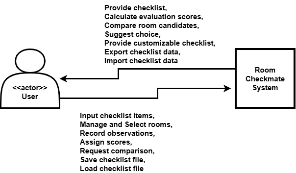

# Room Checkmate

- **A decision support web app for rental room selection**
(자취방 선택을 위한 의사결정 지원 웹 애플리케이션)

  

| 항목 | 내용 |
|:----:|:----:|
| Student No | 22421583 |
| Name | 유혜령 |
| E-mail | hry8585@yu.ac.kr |
| GitHub | https://github.com/HyeRyeongYu/room-decision-assistant |
 

## Revision History

| Revision date | Version | Description |
|:----:|:------:|:------------|
| 2026-03-21 | **0.1** | Initial draft |
| 2026-03-22 | **0.2** | Business purpose |
| 2026-03-22 | **0.3** | References |
| 2026-03-23 | **0.4** | System context diagram |
 

# 1. Business purpose

- 예전부터 오늘날까지 2030세대는 학업과 취업 등의 이유로 자취를 시작하는 경우가 많다. 이 과정에서 원룸, 오피스텔 등의 다양한 주거 공간 중 하나를 선택해야 하며, 주거 환경을 직접 확인하고, 계약을 진행하는 과정에서 여러 요소에 관한 판단과 의사결정 상황에 놓이게 된다. 그러나, 관련 경험과 정보의 부족 그리고 전문 용어에 대한 이해 부족으로 인해 계약 과정에서 어려움을 겪는 경우가 많다. 그 결과, 계약을 체결한 세입자(임차인)는 이전에 충분히 파악하지 못했던 문제를 뒤늦게 발견하고, 이를 해결해야 하는 상황에 직면하기도 한다.
- 특히, 현행 부동산 거래 과정에서는 공인중개사가 계약 체결 직전에 ‘중개대상물 확인·설명서’를 제공할 의무가 있다. (공인중개사법 제25조) 하지만, 소비자가 여러 매물을 탐색하고, 비교하는 초기 단계에서는 공인중개사가 일부 항목을 구두로 설명하는 경우는 있으나, 주거 환경을 체계적으로 기록하고 비교할 수 있는 서면의 형태는 제공하지 않는다. 따라서, 소비자는 인터넷 검색이나 개인적인 경험에 의존하여 체크리스트를 준비하기에, 확인해야 하는 중요 항목을 놓친 채 의사결정을 내리는 문제가 발생하기도 한다. 
- 또한, 기존에 블로그나 유튜브 등의 매체에서 찾을 수 있는 체크리스트는 대부분 여러 매물을 비교할 수 있는 형태가 아닌, 단일 매물을 기준으로 체크리스트가 구성되어 있어, 종합적으로 매물들의 장단점을 비교하고, 판단하는 과정에 한계가 있다. 그리고 최종적으로 결정하기 전까지 여러 매물의 정보를 소비자가 개별적으로 관리하고 보관해야 하는 불편함이 존재한다.
- 따라서, 본 프로젝트에서는 자취방 선택 과정에서 발생하는 문제들을 해결하기 위해, 사용자가 다양한 매물을 체계적으로 평가하고, 비교할 수 있도록 웹 기반의 의사결정 지원 시스템을 개발하고자 한다. 이 시스템은 중개대상물 확인·설명서의 항목과 내용을 바탕으로 체크리스트 기능을 제공하며, 각 매물에 대한 사용자의 평가 결과를 점수로 정량화하여 의사결정의 정확도를 높이고, 중요한 항목의 확인 누락을 방지함으로써, 중개 계약 이후의 리스크를 줄이는 것을 목표로 한다.

 

# 2. System context diagram

Figure 1. System Context Diagram

### (1) User → System
- Input checklist items : 방(매물) 평가를 위한 체크리스트 항목 입력
- Manage and Select rooms : 여러 방 후보 선택 및 관리
- Record observations : 각 방에 대한 관찰 사항 및 메모 기록
- Assign scores : 체크리스트 기준에 따른 평가 점수 부여
- Request comparison : 서로 다른 방 후보 간의 비교 요청

### (2) System → User
- Provide checklist : 법적 가이드라인(중개대상물 확인·설명서)에 기반한 구조화된 체크리스트 제공
- Calculate evaluation scores : 각 방에 대한 항목 평가 점수 계산 제공
- Compare room candidates : 다수의 방 후보 간 비교 결과 제공
- Suggest choice : 사용자 입력 및 평가를 기반으로 최적의 방 추천
- Calculate estimated cost : 주거 관련 예상 비용 계산
- Provide customizable checklist : 사용자 맞춤 체크리스트 항목 제공
  
 

# 7. References
(1) [공인중개사법 제25조(중개대상물의 확인·설명)](https://casenote.kr/%EB%B2%95%EB%A0%B9/%EA%B3%B5%EC%9D%B8%EC%A4%91%EA%B0%9C%EC%82%AC%EB%B2%95/%EC%A0%9C25%EC%A1%B0)
