# Room Checkmate : Design Document

- **A decision support web app for rental room selection**
(자취방 선택을 위한 의사결정 지원 웹 애플리케이션)

  

| 항목 | 내용 |
|:----:|:----:|
| Student No | 22421583 |
| Name | 유혜령 |
| E-mail | hry8585@yu.ac.kr |
| GitHub | https://github.com/HyeRyeongYu/room-decision-assistant |
 

## Revision History

| Revision date | Version | Description |
|:----:|:------:|:------------|
| 2026-05-28 | **0.1** | Initial draft |
| 2026-05-28 | **0.2** | Introduction |
| 2026-05-28 | **0.3** | Class diagram |
| 2026-05-31 | **0.4** | Sequence diagram |
| 2026-05-31 | **0.5** | State machine diagram |
| 2026-05-31 | **0.6** | Implementation requirements |
| 2026-05-31 | **0.7** | Glossary |
| 2026-05-31 | **0.8** | References |
 

# = Contents =

- [1. Introduction](#1-introduction)
- [2. Class diagram](#2-class-diagram)
- [3. Sequence diagram](#3-sequence-diagram)
- [4. State machine diagram](#4-state-machine-diagram)
- [5. Implementation requirements](#5-implementation-requirements)
- [6. Glossary](#6-glossary)
- [7. References](#7-references)
 

# 1. Introduction

## 1.1 Summary
- 2030세대는 학업과 취업 등의 이유로 자취를 시작하는 경우가 많으며, 주거를 결정하는 과정에서 여러 후보 매물을 비교하고, 다양한 요소를 고려해야 한다. 하지만, 관련 경험과 정보의 부족, 전문 용어에 대한 이해 부족으로 인해 합리적인 의사결정에 어려움을 겪는 경우가 많다. 특히, 공인중개사는 법적으로 계약 직전에 중개대상물 확인·설명서를 제공할 의무가 있으나, 해당 문서는 법률 용어를 중심으로 작성되어 있어, 예비 임차인이 충분히 내용을 이해하고, 활용하기 어렵다.
- 또한, 여러 후보 매물의 상태를 체계적으로 기록하고 비교할 수 있는 도구나 문서가 제공되지 않기에, 임차인이 개별적으로 정보를 관리해야 한다. 이 과정에서 중요한 확인 요소의 누락이 발생할 수 있으며, 계약 체결 이후 예상하지 못한 문제를 해결하기 위해 추가적인 시간과 비용이 발생하는 상황에 직면할 수 있다.
- 따라서, 본 Room Checkmate 시스템을 설계하기 위해 Checklist 중심 구조를 기반으로, 기본 항목의 평가 및 사용자 맞춤 항목 추가, 비교 및 추천 기능을 독립적으로 수행할 수 있도록 구성하며, 두 가지 방식으로 Checklist 데이터를 저장 및 불러오게 할 수 있도록 설계했다.

## 1.2 Important Points of Design
- 이때, 비교 및 추천 기능은 해당 기능을 수행하기 위한 동작 수행 클래스와 기능 수행 결과를 저장하는 클래스로 분리하여 설계한다.
- localStorage를 통해 Checklist의 데이터를 재사용하며, JSON 기반 외부 파일 저장 기능을 통해 브라우저의 캐시 삭제 이후에도 데이터를 백업 및 복원할 수 있도록 설계하였다. 그리고 기기간 데이터 이동 및 이어서 평가하는 것이 가능하도록 설계하였다.
 

# 2. Class diagram
## 2.1 Class diagram
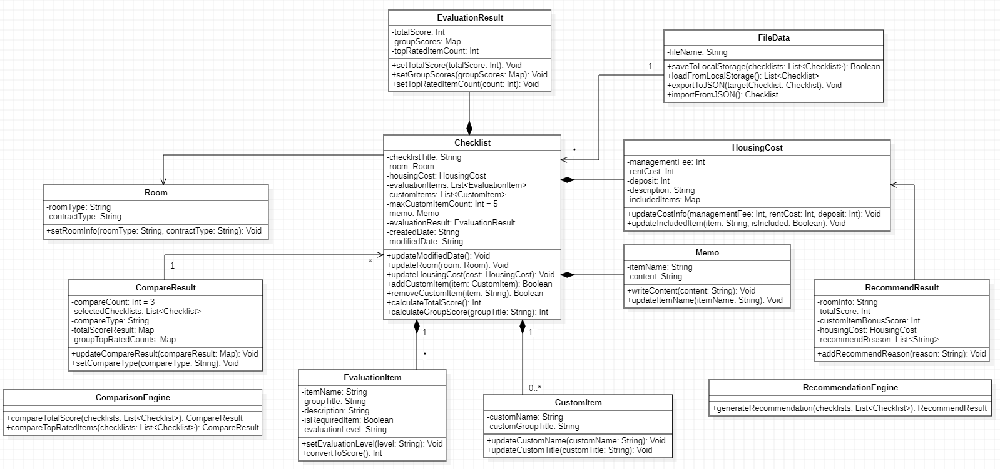
[Figure 1. Class_Diagram]  

## 2.2 Class diagram Description
## 2.2.1 Checklist Class 

### Attributes (속성)
-checklistTitle:String [체크리스트 제목]  
-room:Room [대상 매물 정보]  
-housingCost:HousingCost [주거 비용]  
-evaluationItems:List<EvaluationItem> [기본 평가 항목 리스트]  
-customItems:List<CustomItem> [사용자 맞춤 항목 리스트]  
-maxCustomItemCount:Int=5 [사용자 맞춤 항목 최대 개수]  
-memo:Memo [메모 정보]  
-evaluationResult: EvaluationResult [체크리스트의 평가 결과]  
-createdDate:String [체크리스트 생성 날짜]  
-modifiedDate:String [체크리스트 최종 수정 날짜]  

### Methods (기능)
+updateModifiedDate():Void [체크리스트 수정 날짜 갱신]  
+updateRoom(room:Room):Void [대상 매물 정보 갱신]  
+updateHousingCost(cost:HousingCost):Void [주거 비용 정보 갱신]  
+setChecklistTitle(title:String):Void [체크리스트 제목 설정]  
+addCustomItem(item:CustomItem):Boolean [사용자 맞춤 항목 추가 및 최대 추가 개수 제한 검사]  
+removeCustomItem(item: String): Boolean [사용자 맞춤 항목 삭제]  
+calculateTotalScore():Int [기본 평가 항목과 맞춤 항목의 점수 합산]  
+calculateGroupScore(groupTitle:String):Int [그룹별 점수 합산]  

### Relationship (타 클래스와의 관계)
Association with Room (1:1)  
Composition with HousingCost (1:1)  
Composition with EvaluationItem (1..\*)  
Composition with CustomItem (0..\*)  
Composition with Memo (1:1)  
Composition with EvaluationResult (1:1)  

### Description (클래스 설명)
- Checklist 클래스는 특정 매물(Room)에 대한 평가 데이터를 관리하는 중심 클래스이다.
- 해당 클래스는 주거 비용, 평가 항목, 사용자 맞춤 항목, 메모 및 평가 결과를 포함하며, Room Checkmate 시스템에서 매물 평가의 기본 단위로 사용된다. 
---
- Checklist Class는 Room Class의 객체인 room을 참조한다. 이때, Checklist는 room 객체를 통해 대상 매물의 정보를 화면에 표시하고, 비교 및 추천 기능에 활용한다.
- Room 객체는 Checklist가 평가하는 대상 매물의 정보를 제공하지만, Room Class는 Checklist Class를 참조하거나 사용하지 않으므로, 두 클래스의 관계는 단방향 연관관계(Unidirectional Association)로 연결한다.
 

## 2.2.2 Room Class 

### Attributes (속성)
-roomType:String [매물 유형]  
-contractType:String [계약 유형]  

### Methods (기능)
+setRoomInfo(roomType:String, contractType:String):Void [매물 정보 설정]  

### Relationship (타 클래스와의 관계)
Association with Checklist (1:1)  

### Description (클래스 설명)
- Room 클래스는 비교 대상이 되는 개별 매물의 기본 정보를 나타내는 클래스이다.
- 해당 클래스에는 매물의 유형과 계약 유형 등의 기본 정보를 포함하며, Checklist 클래스와 연결되어 평가 대상 매물 정보를 제공한다.
 

## 2.2.3 EvaluationItem Class 

### Attributes (속성)
-itemName:String [항목 이름]  
-groupTitle:String [그룹 이름]  
-description:String [법률 설명/부가 설명]  
-isRequiredItem:Boolean [필수 항목 여부]  
-evaluationLevel:String [상/중/하 평가]  

### Methods (기능)
+setEvaluationLevel(level:String):Void [평가 선택]  
+convertToScore():Int [평가 점수로 변환]  

### Relationship (타 클래스와의 관계)
Composition with Checklist (1:*)  

### Description (클래스 설명)
- EvaluationItem 클래스는 체크리스트에 포함되는 기본 평가 항목을 나타내는 클래스이다.
- 해당 클래스는 각 항목의 이름, 그룹 이름, 설명 및 필수 여부 등의 속성을 포함하며, 사용자의 평가 상태를 관리한다.
---
- EvaluationItem Class의 객체 evaluationItems는 특정 Checklist를 구성하는 기본 평가 항목으로 사용되기에, 만약 Checklist가 삭제되면, evaluationItems도 함께 삭제된다.
- 따라서, 두 객체는 동일한 라이프 사이클을 가지는 강한 결합 관계이므로, Checklist Class와 EvaluationItem Class는 복합 연관관계(Composition)로 연결한다.
 

## 2.2.4 CustomItem Class 

### Attributes (속성)
-customName:String [사용자가 맞춤 항목명]  
-customGroupTitle:String [사용자 맞춤 그룹명]  

### Methods (기능)
+updateCustomName(customName:String):Void [맞춤 항목명 수정]  
+updateCustomTitle(customTitle:String):Void [맞춤 그룹명 수정]  
+setEvaluationLevel(level:String):Void [평가 선택]  
+convertToScore():Int [평가 점수로 변환]  

### Relationship (타 클래스와의 관계)
Composition with Checklist (0..*)  

### Description (클래스 설명)
- CustomItem 클래스는 기본 항목 외에 개인 기준을 반영하기 위해 사용자가 직접 추가한 평가 항목을 나타내는 클래스이다.
- 사용자는 추가된 항목에 대해서도 시스템에서 제공하는 기준에 따라 평가를 수행한다. 
---
- CustomItem Class의 객체 customItems는 특정 Checklist를 구성하는 사용자 맞춤 평가 항목으로 사용되기에, 만약 Checklist가 삭제되면, customItems도 함께 삭제된다.
- 따라서, 두 객체는 동일한 라이프 사이클을 가지는 강한 결합 관계이므로, Checklist Class와 CustomItem Class는 복합 연관관계(Composition)로 연결한다.
 

## 2.2.5 EvaluationResult 

### Attributes (속성)
-totalScore:Int [체크리스트 총점수]  
-groupScores:Map<String, Int> [그룹별 총점수: 그룹 이름(String)과 그룹 점수(Int)를 저장하는 Map 구조]  
-topRatedItemCount:Int [체크리스트 상위 평가 항목 전체 개수]  

### Methods (기능)
+setTotalScore(totalScore:Int):Void [총점수 갱신]  
+setGroupScores(groupScores:Map<String, Int>):Void [그룹별 총점수 갱신]  
+setTopRatedItemCount(count:Int):Void [상위 평가 항목 전체 개수 갱신]  

### Relationship (타 클래스와의 관계)
Composition with Checklist (1:1)  

### Description (클래스 설명)
- EvaluationResult 클래스는 체크리스트의 평가 결과를 나타내는 클래스이다. 해당 클래스는 총점수 평가 결과와 상위 평가 항목 전체 개수 평가 결과를 속성으로 가진다.
- Room Checkmate 시스템은 해당 클래스를 기반으로 비교 및 추천 기능에서 매물 간 우선순위를 결정하는 기준으로 활용한다.
---
- EvaluationResult Class의 객체 evaluationResult는 특정 Checklist의 평가 결과를 저장하는 객체로 사용되며, 하나의 Checklist마다 하나의 EvaluationResult 객체만 생성된다.
- 또한, Checklist가 삭제되면 evaluationResult도 함께 삭제되며, 두 객체는 같은 라이프 사이클을 가지므로, 강한 결합 관계이다.
- 따라서, Checklist Class와 EvaluationResult Class는 1:1 복합 연관 관계(Composition)로 연결한다.
 

## 2.2.6 HousingCost Class 

### Attributes (속성)
-managementFee:Int [관리비]  
-rentCost:Int [임대료]  
-deposit:Int [보증금]  
-description:String [비용관련 법률 설명/부가 설명]  
-includedItems:Map<String, Boolean> [관리비 포함 비목 항목: 비목 이름(String)과 관리비 포함 여부(Boolean)를 저장하는 Map 구조]  

### Methods (기능)
+updateCostInfo(managementFee:Int, rentCost:Int, deposit:Int):Void [비용 정보 갱신]  
+getHousingCostInfo(): HousingCost [주거 비용 정보 조회]  

### Relationship (타 클래스와의 관계)
Composition with Checklist (1:1)  

### Description (클래스 설명)
- HousingCost 클래스는 체크리스트의 주거 비용 정보를 관리하는 클래스이다. 해당 클래스는 관리비, 임대료(월세/전세), 보증금 및 관리비 포함 비목 항목 정보를 포함하며, 비용 관련 법률 설명 및 부가 설명을 제공한다.
- Room Checkmate 시스템은 해당 클래스를 기반으로 매물 간 비교 및 추천 기능에서 정량적 판단 기준으로 활용한다.
---
- HousingCost Class의 객체 housingCost는 특정 Checklist의 주거 비용을 저장하는 객체로 사용되며, 하나의 Checklist마다 하나의 HousingCost 객체만 생성된다.
- 또한, Checklist가 삭제되면 housingCost도 함께 삭제되며, 두 객체는 같은 라이프 사이클을 가지므로, 강한 결합 관계이다.
- 따라서, Checklist Class와 HousingCost Class는 1:1 복합 연관 관계(Composition)로 연결한다.
 

## 2.2.7 Memo Class

### Attributes (속성)
-itemName:String [항목 이름]  
-content:String [메모 내용]  

### Methods (기능)
+writeContent(content:String):Void [메모 내용 작성 및 수정]  
+updateItemName(itemName:String):Void [항목 이름 작성]  

### Relationship (타 클래스와의 관계)
Composition with Checklist (1:1)  

### Description (클래스 설명)
- Memo 클래스는 체크리스트에 포함되는 메모 정보를 관리하는 클래스이다.
- 해당 클래스는 사용자가 매물 확인 후의 관찰 사항이나 특이 사항을 기록할 수 있는 정보를 포함하며, 평가 항목 외에 추가 정보를 보완하는 역할을 한다.
 

## 2.2.8 ComparisonEngine Class

### Attributes (속성)
None  

### Methods (기능)
+compareTotalScore(checklists:List<Checklist>):CompareResult [총점수 기준 비교 → 비교 결과 생성 → 비교 결과 반환]  
+compareTopRatedItems(checklists:List<Checklist>):CompareResult [상위 평가 항목 개수 기준 비교 → 비교 결과 생성 → 비교 결과 반환]  

### Relationship (타 클래스와의 관계)
None  

### Description (클래스 설명)
- ComparisonEngine 클래스는 체크리스트를 사용자가 선택한 기준에 따라 비교를 수행하는 클래스이다.
- 해당 클래스에서는 비교 기준 유형을 선택하면, 비교 최대 개수 범위 내에 선택된 각 체크리스트의 총점수 혹은 상위 평가 항목의 개수를 비교하고, 비교 결과를 생성한다.
 

## 2.2.9 CompareResult Class

### Attributes (속성)
-compareCount:Int=3 [체크리스트 비교 최대 개수]  
-selectedChecklists:List<Checklist> [비교 대상 체크리스트 목록: Checklist 객체를 저장하는 List 구조]  
-compareType:String [비교 유형 기준]  
-totalScoreResult:Map<String, Int> [총점수 비교 결과: Checklist 이름(String)과 해당 Checklist의 총점수(Int)를 저장하는 Map 구조]  
-groupTopRatedCounts:Map<String, Int> [그룹별 상위 평가 비교 결과: 그룹 이름(String)과 Checklist 내 해당 그룹의 상위 평가 항목 개수(Int)를 저장하는 Map 구조]  

### Methods (기능)
+updateCompareResult(compareResult:Map<String,Int>):Void [비교 결과 갱신]  
+setCompareType(compareType:String):Void [비교 유형 기준 선택]  

### Relationship (타 클래스와의 관계)
Unidirectional Association with Checklist (1 CompareResult : 1..* Checklist)  

### Description (클래스 설명)
- CompareResult 클래스는 체크리스트 비교 결과 정보를 나타내는 클래스이다.
- 해당 클래스는 비교 대상 체크리스트 목록, 비교 유형 기준 및 비교 결과 데이터를 포함하며, 총점 기반 비교 및 상위 평가 항목 개수 비교로 결과를 관리한다.
- Room Checkmate 시스템은 해당 클래스를 기반으로 매물 간 비교 결과를 사용자에게 제공한다.
---
- CompareResult Class의 객체 compareResult는 여러 Checklist 객체의 비교 결과를 저장하는 객체로 사용된다.
- 이때, 하나의 CompareResult 객체는 비교 대상 Checklist 여러 개의 정보를 기반으로 생성되며, 하나 이상의 Checklist를 비교 대상으로 사용한다.
- 따라서, CompareResult Class와 Checklist Class는 다중 단방향 연관관계(Unidirectional Association with 1..*)로 연결한다.
 

## 2.2.10 RecommendationEngine Class

### Attributes (속성)
None  

### Methods (기능)
+generateRecommendation(checklists:List<Checklist>):RecommendResult [총점수 기반 비교 → 사용자 맞춤 항목 존재 시 추가 고려 → 주거 비용 추가 고려 → 가장 적합한 추천 매물 결과 반환]  

### Relationship (타 클래스와의 관계)
None  

### Description (클래스 설명)
- RecommendationEngine 클래스는 최적 매물 추천 기능을 수행하는 클래스이다.
- 해당 클래스는 체크리스트의 총점수, 사용자 맞춤 항목 평가 결과 및 주거 비용 정보를 기반으로 추천 결과를 생성한다.
- Room Checkmate 시스템은 해당 클래스를 통해 사용자에게 최적 매물을 추천한다.
 

## 2.2.11 RecommendResult Class

### Attributes (속성)
-roomInfo:String [추천 매물 기본 정보]  
-totalScore:Int [추천 매물 총점수]  
-customItemBonusScore:Int [사용자 맞춤 항목 반영]  
-housingCost:HousingCost [추천 매물 주거 비용]  
-recommendReason:List<String> [추천 이유 목록]  

### Methods (기능)
+addRecommendReason(reason:String):Void [추천 이유 목록 추가]  

### Relationship (타 클래스와의 관계)
Association with HousingCost (1:1)  

### Description (클래스 설명)
- RecommendResult 클래스는 시스템이 생성한 최적 매물 추천 결과를 나타내는 클래스이다.
- 해당 클래스는 선택한 체크리스트를 기반으로 총점수, 사용자 맞춤 항목 반영 점수, 주거 비용 및 시스템 추천 이유 목록을 포함한다.
- Room Checkmate 시스템은 해당 클래스를 기반으로 총점수, 사용자 맞춤 항목 및 주거 비용 정보를 반영하여 사용자에게 가장 적합한 추천 매물을 제공한다.
 

## 2.2.12 FileData Class

### Attributes (속성)
-fileName:String [파일 이름]  

### Methods (기능)
+saveToLocalStorage(checklists:List<Checklist>):Boolean [체크리스트의 리스트 로컬 스토리지에 저장]  
+loadFromLocalStorage():List<Checklist> [로컬 스토리지로 전체 체크리스트 불러오기]  
+exportToJSON(targetChecklist: Checklist):Void [외부 JSON 파일로 저장]  
+importFromJSON():Checklist [외부 JSON 파일로 불러오기]  
+addChecklist(checklist: Checklist): Boolean [체크리스트 목록에 추가]  

### Relationship (타 클래스와의 관계)
Association with Checklist (1 FileData : 1..* Checklist)  

### Description (클래스 설명)
- FileData 클래스는 체크리스트의 데이터를 저장 및 불러오기 위한 클래스이다.
- 해당 클래스는 로컬 스토리지 저장과 외부 JSON 파일로 저장 및 불러오기 기능을 지원한다.
- Room Checkmate 시스템은 해당 클래스를 기반으로 체크리스트 데이터 저장과 데이터 이동 및 체크리스트 재사용을 지원한다.
 

# 3. Sequence diagram
## 3.1 Use Case #1 : Add room candidate (체크리스트 생성, Exception 포함)
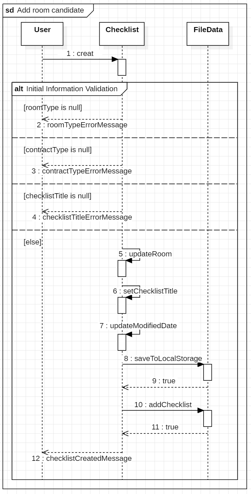
[Figure 2. Add room candidate Sequence diagram]  

- 사용자가 체크리스트 메뉴을 통해 체크리스트 생성을 위한 초기 정보를 입력하고 생성 버튼을 누르면, 시스템은 3개의 초기 정보 입력 누락 여부를 확인한다. 만약, 누락된 항목이 있는 경우 해당하는 오류 메시지를 사용자에게 제공해 입력을 요청한다.
- 모든 초기 정보가 정상적으로 입력된 경우, Checklist 클래스의 updateRoom() 메소드와 setChecklistTitle() 메소드를 통해, 초기 정보 입력을 생성한 체크리스트에 반영한다. 그리고 수정 날짜를 갱신 후 FileData 클래스의 saveToLocalStorage() 메소드를 통해 해당 데이터를 localStorage에 저장하고, FileData 클래스의 addChecklist() 메소드를 통해 생성된 체크리스트를 목록에 추가한 후에 사용자에게 체크리스트 생성 완료 메시지를 제공한다.
 

## 3.2 Use Case #2 : Enter housing cost (체크리스트 주거비용 입력, Exception 포함)
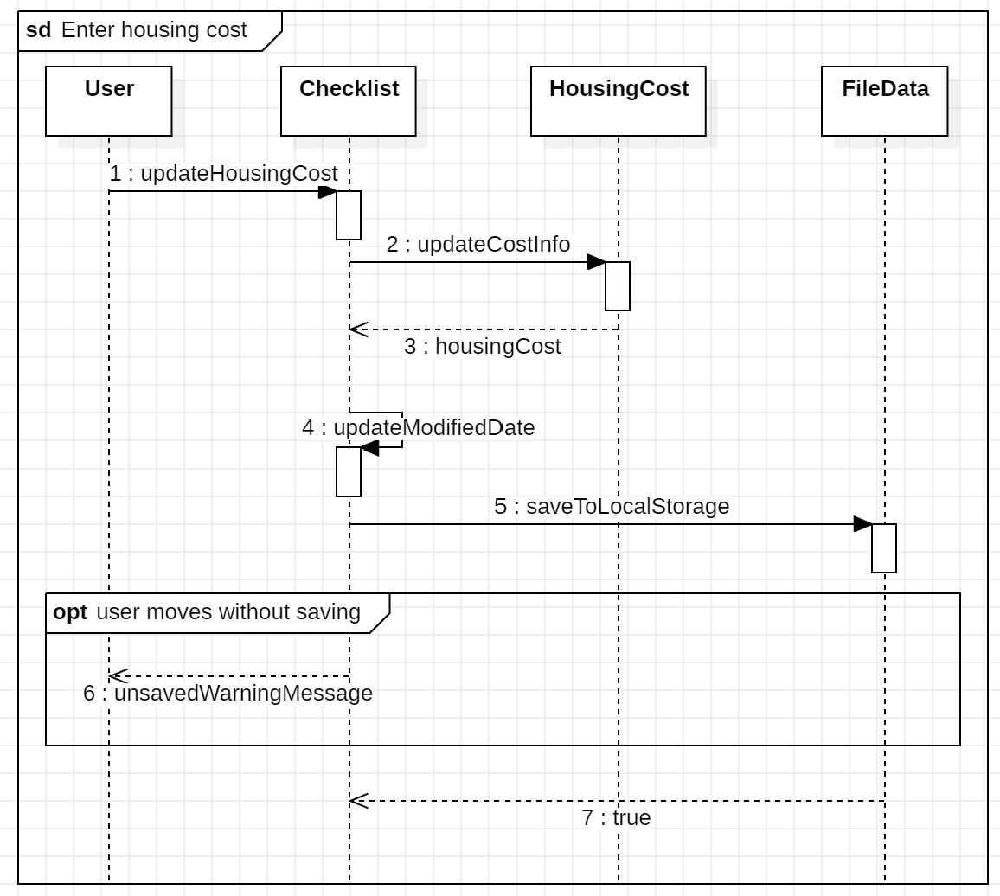
[Figure 3. Enter housing cost Sequence diagram]  

- 사용자가 선택한 체크리스트의 주거 비용 그룹의 각 항목에 정보를 입력하면, Checklist 클래스는  updateHousingCost() 메소드를 통해 사용자가 입력한 값을 받아 처리하고, HousingCost 클래스의 updateCostInfo() 메소드를 호출하여, 주거 비용 정보를 갱신한다.
- 이후 사용자가 체크리스트 저장 버튼을 클릭하면, Checklist 클래스는 FileData 클래스의 saveToLocalStorage() 메소드를 호출하여 갱신된 주거 비용 정보를 localStorage에 저장하며, 저장이 완료되면 저장 성공 여부를 반환한다. 또한 사용자가 주거 비용 정보를 입력한 후 저장하지 않고 다른 화면으로 이동하려는 경우, 시스템은 저장되지 않은 내용이 있음을 알리는 경고 메시지를 표시한다.
 

## 3.3 Use Case #3 : Evaluate room with checklist (체크리스트 항목 평가, Exception 포함)
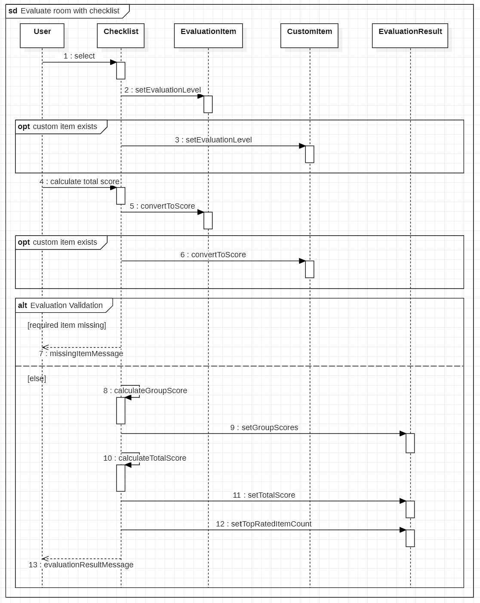
[Figure 4. Evaluate room with checklist Sequence diagram]  

- 사용자가 평가하고자 하는 체크리스트를 선택하면, 시스템이 선택한 체크리스트를 화면에 제공한다. 사용자는 상/중/하 중 1개를 선택한다. 이때, 기본 평가 항목 외에 사용자가 추가로 맞춤 항목을 생성한 경우에는 사용자 맞춤 항목까지 평가한다.
- 그리고 사용자는 화면에 보이는 총점수 계산 버튼을 누르면, EvaluationItem 클래스와 CustomItem 클래스의 convertToScore() 메소드를 통해 기본 평가 항목과 맞춤 항목에 대한 평가를 점수로 변환한다. 만약, 사용자가 시스템 상 정해져 있는 필수 항목의 평가를 누락하고 총점수 계산 버튼을 누르면, 시스템은 사용자에게 누락된 필수 항목의 평가를 요청한다.
- 이후, UI상에서 제공될 그룹별 총점수와 전체 총점수 및 상위 평가 항목 전체 개수를 계산하여, 시스템은 사용자에게 계산된 총점수와 상위 평가 항목 전체 개수를 팝업 메시지 보여준다.
 

## 3.4 Use Case #4 : Customize checklist (체크리스트 사용자 맞춤 항목 추가, Exception 포함)
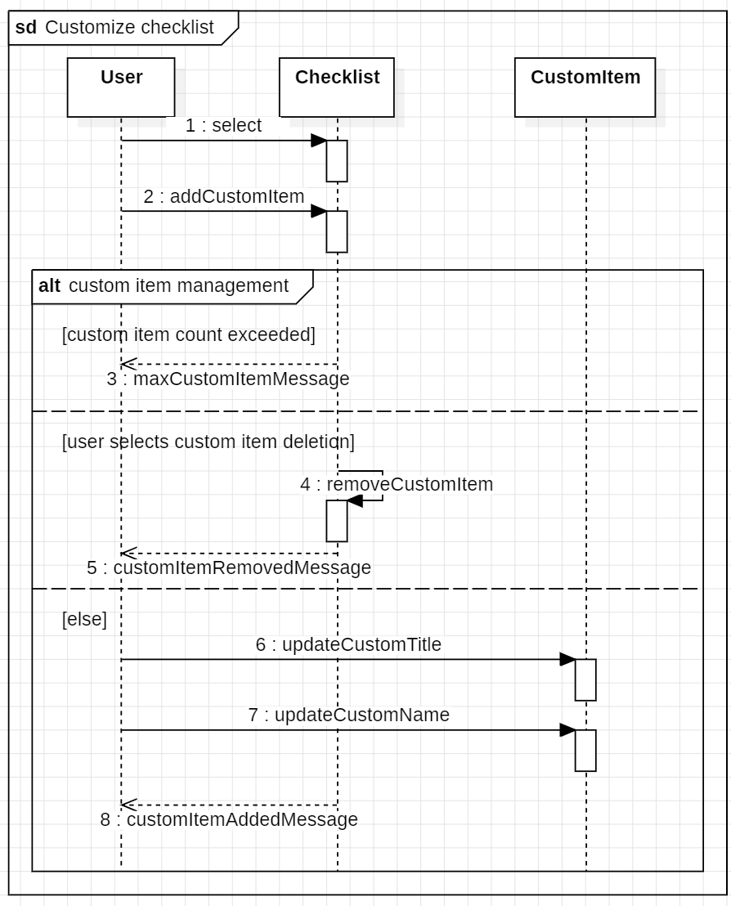
[Figure 5. Customize checklist Sequence diagram]  

- 사용자 맞춤 항목의 추가를 원하는 경우, 맞춤 항목 추가 버튼을 누르면, 시스템은 허용된 최대 개수까지 사용자가 맞춤 항목을 생성할 수 있도록 제공한다. 생성한 맞춤 항목에 사용자는 그룹명과 항목명을 수정할 수 있으며, 해당 내용은 시스템이 CustomItem 클래스의 updateCustomTitle() 메소드와 updateCustomName() 메소드를 통해 갱신한다.
- 만약 사용자가 허용된 최대 개수를 초과하여 추가하려는 경우, 시스템은 추가 생성을 제한하고 안내 메시지를 통해 사용자에게 더 이상 맞춤 항목을 추가할 수 없음을 알린다. 또한, 사용자가 맞춤 항목의 삭제를 원하는 경우, 시스템은 Checklist 클래스의 removeCustomItem() 메소드를 통해 기존에 생성된 사용자 맞춤 항목을 제거하고, 사용자에게 팝업 메시지를 통해 삭제 완료를 안내한다.
 

## 3.5 Use Case #5 : Record room observations (체크리스트 메모 추가, Exception 포함)
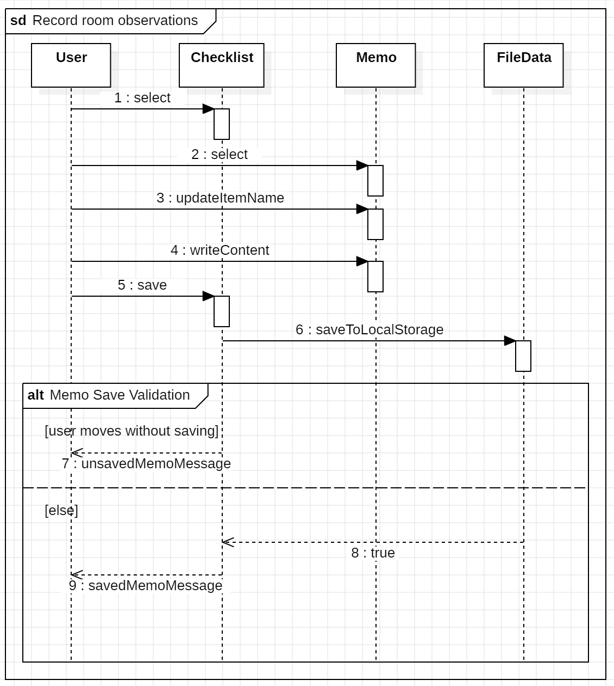
[Figure 6. Record room observations Sequence diagram]  

- 사용자가 체크리스트에 추가적인 내용을 자유롭게 작성하기 위해 메모 그룹을 선택하면, 시스템은 메모 항목에 대한 입력 영역을 제공한다. 사용자는 메모 그룹에 항목명과 내용을 작성하고 저장 버튼을 누르면, 시스템은 Memo 클래스의 updateItemName() 메소드와 writeContent() 메소드를 통해 입력된 항목명과 메모 내용을 갱신한다.
- 그리고 FileData 클래스의 saveToLocalStorage() 메소드를 통해 localStorage에 해당 데이터를 저장하고, 저장 완료 메시지를 사용자에게 제공한다. 만약, 사용자가 저장 버튼을 누르지 않고 체크리스트 화면에서 다른 메뉴로 이동하는 경우, 시스템은 저장되지 않은 메모가 있음을 안내하는 경고 메시지를 표시한다.
 

## 3.6 Use Case #6 : Compare rooms (체크리스트 비교, Exception 포함)
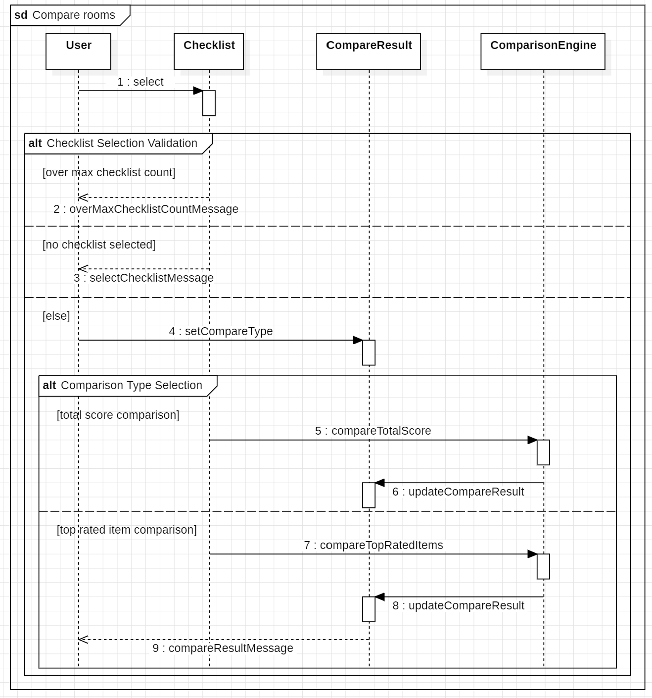
[Figure 7. Compare rooms Sequence diagram]  

- 사용자가 체크리스트 비교를 요청한 경우, 시스템은 체크리스트 선택 목록과 비교 기준 선택 화면을 제공한다. 이때, 사용자는 허용된 최대 개수 범위 내에서 비교할 체크리스트를 선택하고, 2가지 종류의 비교 버튼 중 하나를 선택할 수 있다. 만약 사용자가 허용된 최대 개수를 초과하여 체크리스트를 선택하거나, 체크리스트를 선택하지 않은 상태에서 비교를 요청하는 경우 시스템은 안내 메시지를 표시한다.
- 이후 사용자가 총점수 기반 비교 또는 상위 평가 항목 개수 기반 비교를 선택하면, 시스템은 ComparisonEngine 클래스의 compareTotalScore() 메소드 또는 compareTopRatedItems() 메소드를 통해 선택한 기준에 따른 비교 결과를 생성하고, CompareResult 클래스의 updateCompareResult() 메소드를 호출하여 비교 결과를 갱신한다. 그리고 시스템은 생성된 비교 결과를 사용자에게 제공한다.
 

## 3.7 Use Case #7 : View recommended room (추천 매물 확인, Exception 포함)
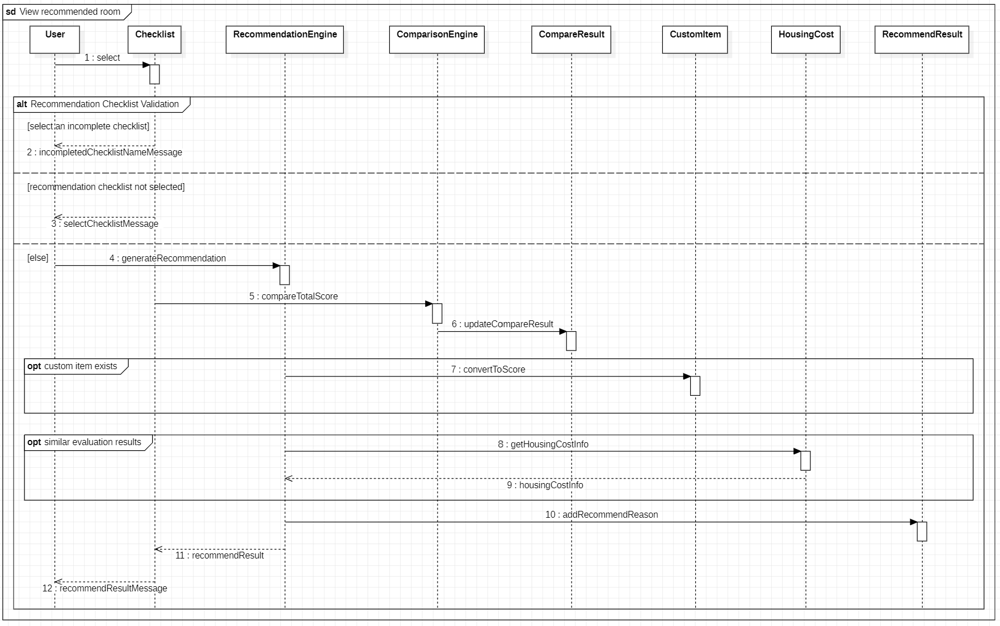
[Figure 8. View recommended room Sequence diagram]  

- 사용자가 매물 추천을 요청하는 경우, 시스템은 추천 기능 수행을 위한 체크리스트 선택 화면을 사용자에게 제공한다. 만약 사용자가 현재 평가가 완료되지 않은 체크리스트를 선택하거나, 체크리스트를 선택하지 않은 상태에서 추천 버튼을 누르는 경우, 시스템은 관련 안내 메시지를 표시하여 추천 기능을 제한한다.
- 이후 사용자가 최적 매물 추천 버튼을 누르면, 시스템은 ComparisonEngine 클래스의 compareTotalScore() 메소드를 통해 선택된 체크리스트들의 총점수 기준 비교를 수행하고, 비교 결과를 생성한다. 또한 선택된 체크리스트에 사용자 맞춤 항목이 있는 경우, 시스템은 CustomItem 클래스의 convertToScore() 메소드를 통해 사용자 맞춤 항목의 평가 결과를 점수로 변환하여 추천 과정에 추가로 반영한다.
- 유사한 평가 결과를 가진 매물이 2개 이상 존재하는 경우, 시스템은 HousingCost 클래스의 getHousingCostInfo() 메소드를 통해 주거 비용를 조회하고 이를 추가로 고려하여 최종 비교를 수행한다. 그리고 시스템은 RecommendResult 클래스의 addRecommendReason() 메소드를 통해 추천 이유를 갱신하고, 사용자에게 추천 결과 화면을 제공한다.
 

## 3.8 Use Case #8 : Save evaluation results (체크리스트 평가 결과 저장, Exception 포함)
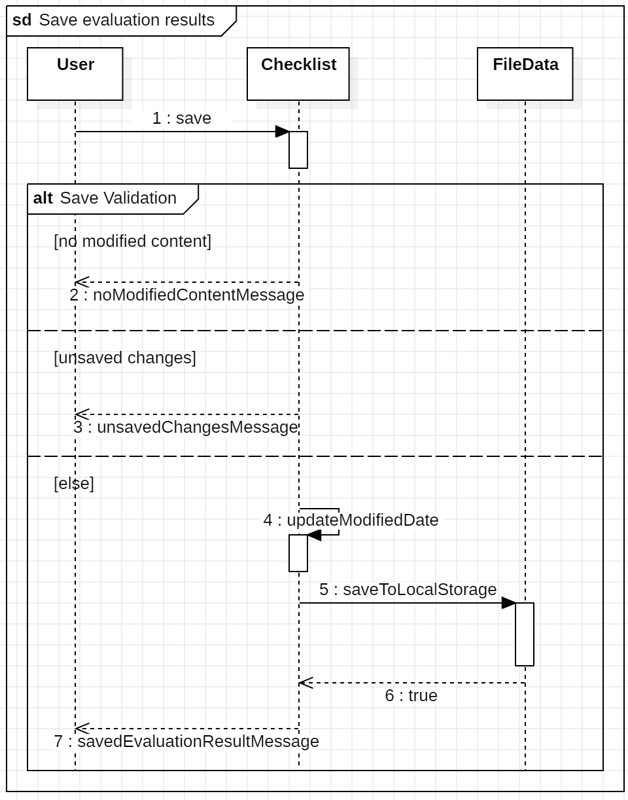
[Figure 9. Save evaluation results Sequence diagram]  

- 사용자가 체크리스트 평가 결과를 저장하기 위해 저장 버튼을 누르면, 시스템은 현재 체크리스트의 입력 및 평가 내용을 확인하고 저장 과정을 수행한다. 만약 사용자가 변경된 내용이 없는 체크리스트의 저장 버튼을 누르거나, 체크리스트에 변경된 내용이 존재하는 상태에서 저장하지 않고 다른 메뉴로 이동하는 경우, 시스템은 각 상황에 맞는 안내 팝업 메시지를 표시한다.
- 오류 상황이 없다면, 시스템은 Checklist 클래스의 updateModifiedDate() 메소드를 통해 체크리스트의 수정 날짜를 갱신하고, FileData 클래스의 saveToLocalStorage() 메소드를 통해 체크리스트를 localStorage에 저장한다. 이후 저장이 완료되면 저장 완료 메시지를 사용자에게 표시한다.
 

## 3.9 Use Case #9 : Save checklist data (체크리스트 외부 파일로 저장, Exception 포함)
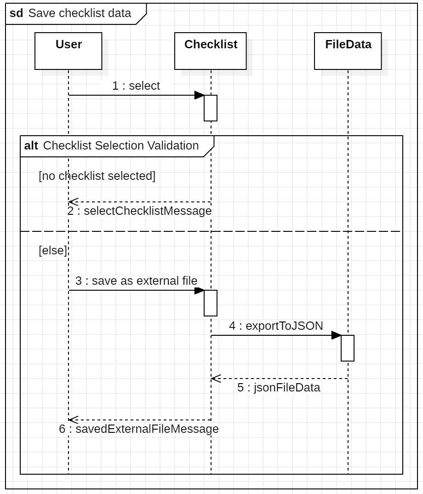
[Figure 10. Save checklist data Sequence diagram]  

- 사용자가 체크리스트 데이터를 외부 파일로 저장하는 것을 요청한 경우, 시스템은 체크리스트 선택 화면을 사용자에게 제공한다. 사용자는 체크리스트를 목록에서 선택하고 외부 파일로 저장하기 버튼을 누르면, 시스템은 체크리스트 데이터를 JSON 형식의 외부 파일로 변환하는 기능을 수행한다.
- 만약 사용자가 목록에서 체크리스트를 선택하지 않은 상태에서 외부 파일 저장을 요청하는 경우, 시스템은 체크리스트 선택을 요청하는 팝업 메시지를 표시한다. 이후 시스템은 FileData의 exportToJSON() 메소드를 통해 선택된 체크리스트 데이터를 JSON 형식의 외부 파일로 변환하고, 생성된 JSON 파일을 다운로드 형태로 사용자에게 제공한다.
 

## 3.10 Use Case #10 : Load checklist data (체크리스트 외부 파일 불러오기, Exception 포함)
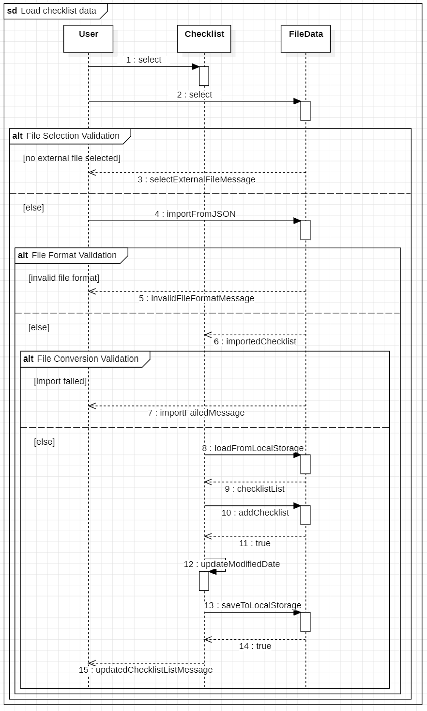
[Figure 11. Load checklist data Sequence diagram]  

- 사용자가 이전에 저장한 외부 파일을 시스템의 체크리스트 형태로 불러와 재사용하기 위해 외부 파일 불러오기 버튼을 누르면, 시스템은 선택된 파일의 데이터를 읽고, 외부 파일 데이터를 시스템에서 제공하는 체크리스트 형식으로 변환하는 작업을 수행한다.
- 만약 사용자가 외부 파일을 선택하지 않은 상태에서 불러오기를 요청하거나, 외부 파일을 선택했으나 시스템에서 지원하는 올바른 파일 형식이 아닌 경우, 시스템은 해당 오류 메시지를 사용자에게 표시한다. 그리고 시스템이 외부 파일을 체크리스트 형식으로 변환하는 데 실패한 경우, 파일을 변환할 수 없음을 안내하는 팝업 메시지를 표시한다.
- 이후 외부 파일이 성공적으로 체크리스트 형식으로 변환되면, 시스템은 FileData 클래스의 loadFromLocalStorage() 메소드를 통해 localStorage에 저장된 전체 체크리스트 불러오고, addChecklist() 메소드를 통해 변환된 체크리스트를 기존 목록에 추가한다.
- Checklist 클래스의 updateModifiedDate() 메소드를 통해 수정 날짜를 갱신하고, FileData 클래스의 saveToLocalStorage() 메소드를 통해 현재 체크리스트 목록을 localStorage에 저장한다. 그리고 시스템은 갱신된 체크리스트 목록을 사용자에게 제공한다.
 

# 4. State machine diagram
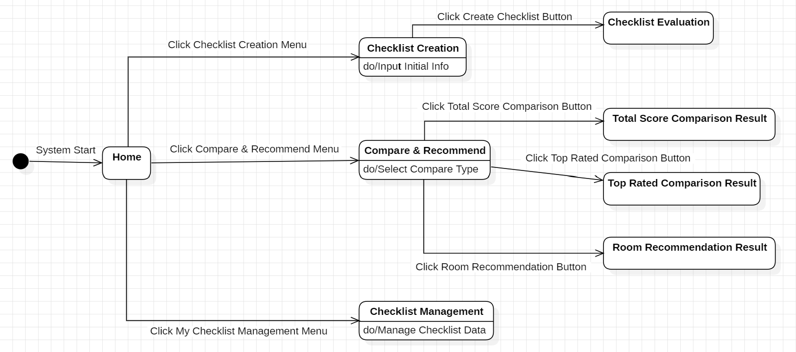
[Figure 12. Room Checkmate System State machine diagram]  

- Room Checkmate 시스템을 시작하면, 홈 화면이 제공되며, 사용자는 체크리스트 생성, 비교&추천, 내 체크리스트 관리 메뉴 중 하나를 선택할 수 있다.
- 체크리스트 생성 메뉴를 선택하면, 체크리스트의 기본 정보를 입력할 수 있는 화면으로 이동한다. 해당 화면에서 사용자가 기본 정보를 모두 입력한 후 체크리스트 생성 버튼을 누르면, 사용자가 선택 및 작성한 유형과 체크리스트 이름에 맞는 기본 체크리스트 평가 화면으로 전환된다.
- 비교&추천 메뉴를 선택하면, 총점수 기반 비교, 상위 평가 항목 기반 비교, 최적 매물 추천 기능을 선택할 수 있는 화면으로 이동한다. 사용자는 원하는 기능의 버튼을 눌러 비교 결과 화면 또는 추천 결과 화면으로 이동할 수 있다.
- 내 체크리스트 관리 메뉴를 선택하면, 생성된 체크리스트를 관리할 수 있는 화면으로 이동하며, 체크리스트의 데이터를 관리할 수 있는 기능 버튼을 선택할 수 있는 화면이 제공된다.
 

# 5. Implementation requirements
## 5.1 H/W Platform Requirements 
| **Item** | **Requirement** |
| -------- | --------------- |
| Processor | Intel i3 or higher CPU |
| Memory | 4GB RAM |
| Storage | 1GB Available Space |
| Network | Internet Connection |
 

## 5.2 S/W Platform Requirements
| **Item** | **Requirement** |
| -------- | --------------- |
| OS | Windows 10 or higher |
| Web Browser | Google Chrome, Microsoft Edge |
| Implementation Language | HTML5, CSS3, JavaScript |
| Data Storage | Browser localStorage |
 

# 6. Glossary
| 항목 | 내용 |
| ------ |------|
| 매물 | 본 시스템에서 사용자가 평가 및 비교 대상으로 선택하는 임대용 주거 부동산 |
| 사용자 추가 항목 | 본 시스템에서 기본 체크리스트 외에 사용자가 개인 기준에 따라 추가로 생성하는 맞춤 평가 항목 |
| 체크리스트(Checklist) | 본 시스템에서 매물 평가를 위해 제공되는 항목들의 집합으로, 사용자가 각각의 항목을 기준으로 매물을 평가할 수 있도록 구성된 구조 |
| 주거 비용 (Housing Cost) | 본 시스템에서 사용자가 입력하는 비용 정보로, 보증금, 월세(전세), 관리비 및 관리비 포함 비목 등을 포함한다. 체크리스트 비교 및 추천 과정에서 추가 비교 기준으로 활용된다. |
| 평가 결과 (Evaluation Result) | 본 시스템에서 제공하는 체크리스트의 평가 항목을 점수로 환산하여 계산한 결과이다. 총점수, 그룹별 점수, 상위 평가 항목 개수 등의 정보를 포함한다. |
| localStorage | 웹 브라우저에서 제공하는 저장소로, 본 시스템에서는 사용자의 체크리스트 데이터를 로컬 환경에 저장하기 위해 사용한다. |
| JSON (JavaScript Object Notation) | 데이터를 저장하고 교환하기 위한 텍스트 기반 형식으로, 본 시스템에서는 체크리스트 데이터를 외부 파일 형태로 저장 및 불러오기 위해 사용한다. |
 

# 7. References
(1) 강의자료 : Structural Modeling II, Behavior Modeling I, II  
(2) 참고자료  
https://cjwoov.tistory.com/80#google_vignette
[자바 스크립트로 로컬에 저장된 JSON 파일을 읽어오는 방법]

https://developer88.tistory.com/entry/JSON-%ED%8C%8C%EC%9D%BC-%EB%A1%9C-%EB%8D%B0%EC%9D%B4%ED%84%B0-%EB%B3%80%ED%99%98%ED%95%B4-%EC%A0%80%EC%9E%A5%ED%95%98%EA%B8%B0-NodeJS-Path-Serialize
[JSON 파일로 데이터 변환하여 저장하는 방법]
 
